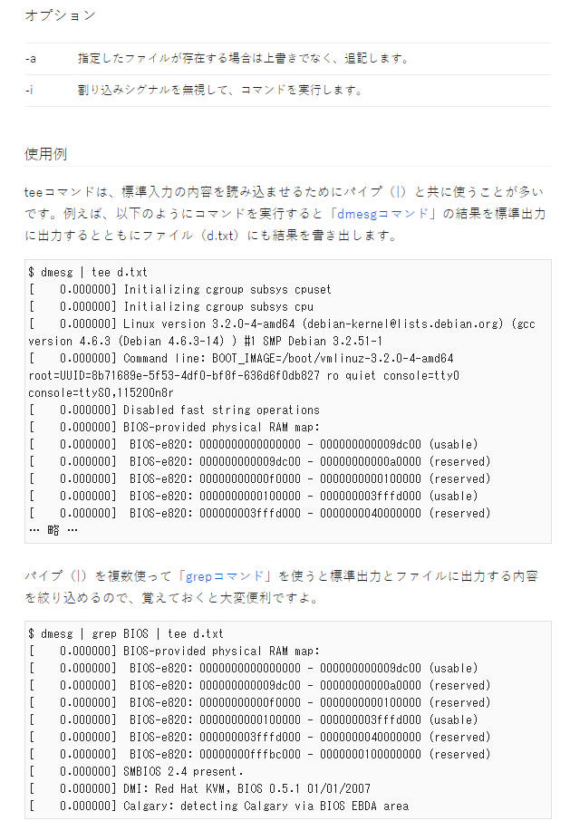
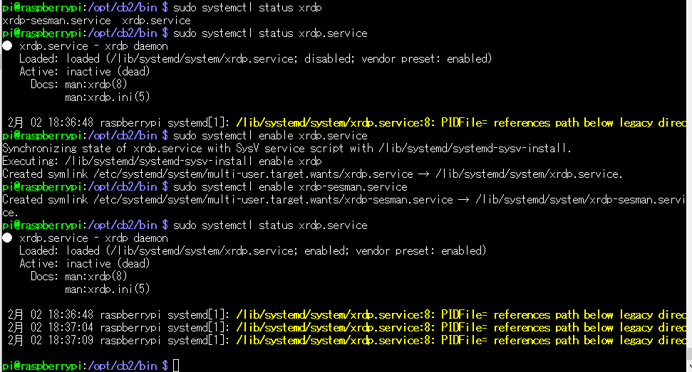

## scp

ネットワーク経由でファイルをコピーできる

rootユーザ相手(root@~)には、遅れないから注意

```
scp hogehoge.txt pi@172.23.1.99:/tmp

```

## tee(ティー)

標準出力とファイルに出力する

使用例を以下を参考にしてください

自分は、以下のように使ってた

```bash
# 実行コマンドの結果を、標準出力とtest.logに出力する

./test | tee test.log
```



## more

テキストファイルを1画面ずつ表示コマンドです

Enterで1行ずつ更新
space で1画面ずつ更新

Q とか q で終了

ふつうは、他のコマンドと組み合わせる

```bash
# cat で表示する内容を パイプ で more コマンドに渡す
cat -n /etc/bashrc | more
```
[参考URL](https://www.atmarkit.co.jp/ait/articles/1602/26/news027.html)

## systemctl

systemctlは、systemdを操作するコマンドで、
サービスの起動・停止・状態確認などができる



[参考URL](https://qiita.com/shimajiri/items/ae8fe481bea3e9660a0c)
